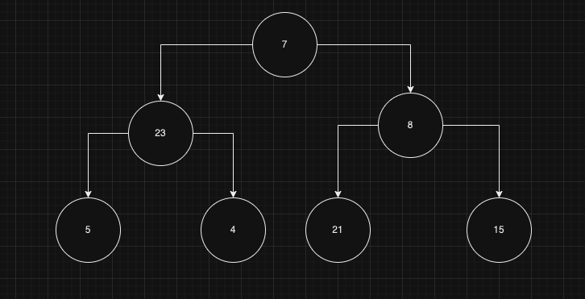

## Breadth-first search

Consider the following binary tree:

Breadth-first search is in a sense the opposite of depth-first search, hence the data structure that it is used for this kind of algorithm is a _queue_, i.e. first in first out.

In breadth-first search we explore a tree _level-by-level_, so in the example above, the sequence of nodes we would visit is: 7, 23, 8, 5, 4, 21, 15. Notice how the first element that is printed was also the first one to be added to the queue (FIFO).

The running time will be `O(N)`, but if we use JavaScript arrays it will actually be `O(N^2)`. We know that for array lists, `.push` and `.pop` operation are fast, (i.e. `O(N)`), while shift and unshift operations are linear-time operations and we also know that those operations are equivalent to enqueue and dequeue.

The other thing is that when we traverse a binary tree we can see that each new level, if complete, is approximately half the size of the entire tree above it, so a binary tree tends to "grow" really fast. This means that it is crucial to use the right data structure for such a procedure, a that structure is a queue.
