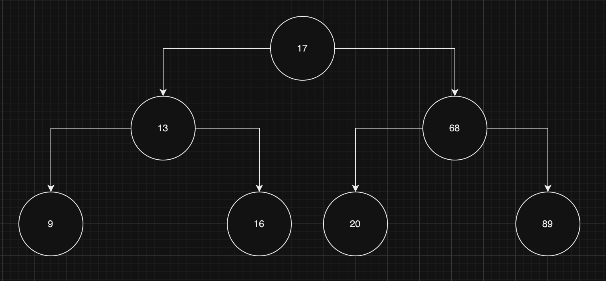

## Depth-first search

Depth-first search usually is done with a _binary search tree_, which is a tree with some further constraints on the children of a node. More specifically, in a binary search tree, given a node, its left child value should be smaller than the parent value and its right child value should be bigger than the parent value. It is effectively the tree version of an ordered array, and in fact depth-first search is reminiscent of quick sort.

Here's an example of a binary search tree:

