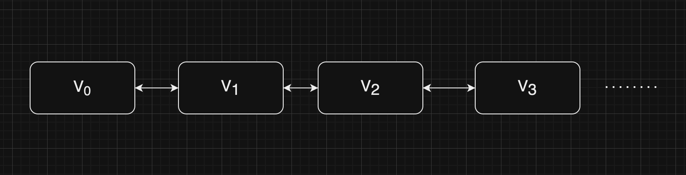

## LRU cache

LRU is a caching mechanism that says that we will evict the least recently used item. We can visualize caching as node-based system which contains values:

In this LRU setting, we should be able to ask if we have a certain value, say V2, and then make it the "most recently used" element by moving it at the front of the cache, while the last value on the opposite side will be the least recently used. This cache is a doubled-linked list, but how do we ask for V2? To do this efficiently we need some sort of key, so hash maps are a good option! Eventually, the LRU cache will combine a hash map with a doubled-linked list, so that we can retrieve values efficiently we avoid to traverse the entire list, which was inefficient.
