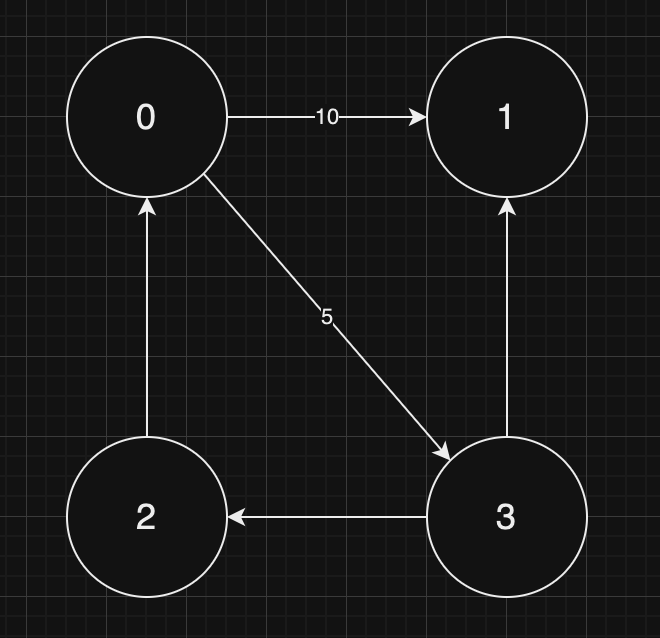

## Graphs

Graphs are a series of nodes with some amount of connection. Let's start with some terminology first:

- A _cycle_ is when we start at node x and, after covering at least three nodes including x, we end up at x again.
- _acyclic_ is a graph with no cycles.
- A graph is _connected_ when every node has a path to another node.
- A graph is _directed_ when connections have a direction.
- A _weighted_ graph is when connections have a weight associated to them.

Consider the following graph:



We can represent this graph in two different ways:

As an _adjacency list_, i.e. an array which, for each node in the graph, tells to what other node it is connected, if there are any. It also tells us the weight of the edge, if any. For the graph above, the adjacency list is:

```
[[{to: 1, weight: 10}, {to: 3, weight: 5}], [], [{to: 1}, {to: 2}], [{to: 0}]]
```

As an adjacency matrix, i.e. a table which tells us all the connections between each node, in the following way:

|     | 0   | 1   | 2   | 3   |
| --- | --- | --- | --- | --- |
| 0   | 0   | 10  | 0   | 5   |
| 1   | 0   | 0   | 0   | 0   |
| 2   | etc |
| 3   | etc |

This matrix is computationally very expensive because it requires V^2 nodes to be represented in memory, and even if there are only a few edges in the graph.

Since graphs are trees, breadth-first search and depth-first search can be done on graphs as well.

The following is an implementation of breadth-first search on a (weighted) adjacency matrix:
