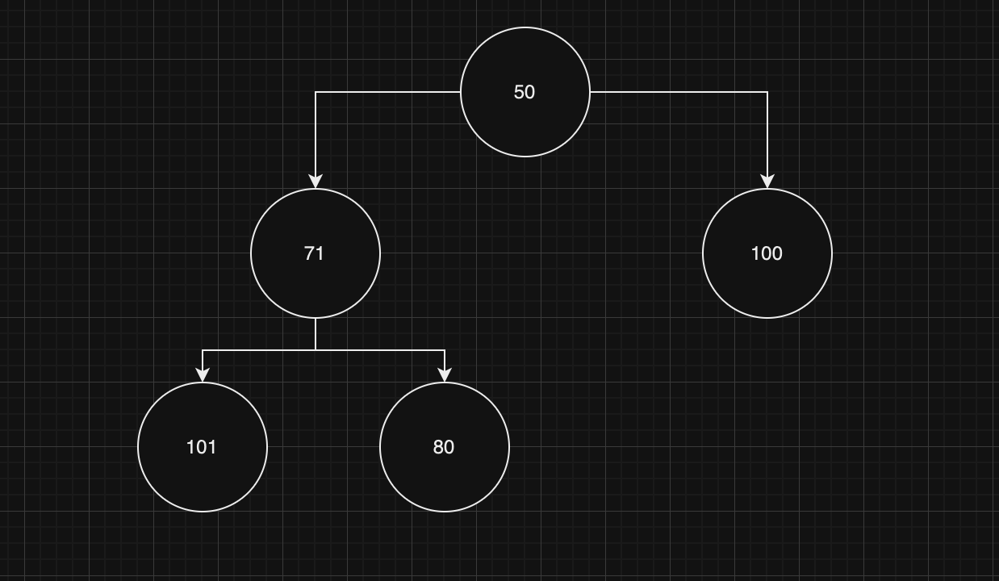
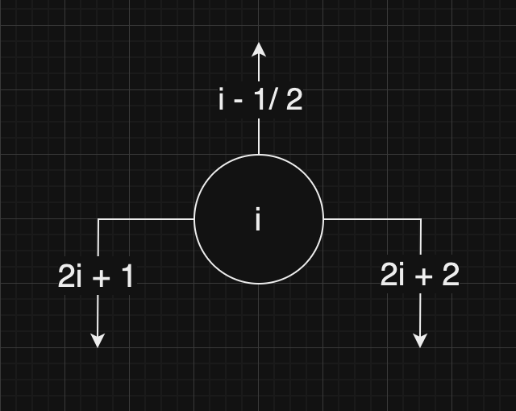

## Heaps

A _heap_ is a binary tree where each child is smaller (MaxHeap) or bigger (MinHeap) than the current node.

Here's an example of a min-heap:



We could say: why if 80 in that position since it is smaller than 100 on the right? The thing is that heaps are _weakly ordered_, so what matters is only the parent-child relationship.

How do we add a new node in a MinHeap?

- We go to the final spot in the tree and we add the node, for example in our MinHeap it could be added as a child of 101.
- If it is smaller than the parent, we trade places with the parent, and we repeat the same check and, if necesarry, switch of places, until we find the right place.

And what about deleting?

- Let's delete the head in our example (the minimum value)
- We then go to the final spot and take 101, and we replace it with 50.
- Now we need to reconstruct the tree "as it was", so we look at 71 and swap places, so 71 becomes the head. We continue until the order is correct.

But the question here is: how do we get 101? How do we reach it? We need to find another way to "store" a tree so that we can work with it more easily.
We could store it as sort of array, like so:

```
[50, 71, 100, 101, 80]
```

But can we keep track of the parent-child relationship? There are some calculations based on indices that we can do:



Where `i` is the index of the node in the array.

The following is an implementation of a heap class:

```
export default class MinHeap {
    public length: number;
    private data: number[];

    constructor() {
        (this.data = []), (this.length = 0);
    }

    insert(value: number): void {
        this.data[this.length] = value;
        this.heapifyUp(this.length);
        this.length++;
    }

    delete(): number {
        if (this.length === 0) {
            return -1;
        }

        const out = this.data[0];
        this.length--;

        if (this.length === 0) {
            this.data = [];
            return out;
        }

        this.data[0] = this.data[this.length];
        this.heapifyDown(0);
        return out;
    }

    private heapifyDown(idx: number): void {
        const lIdx = this.leftChild(idx);
        const rIdx = this.rightChild(idx);

        if (lIdx >= this.length || idx >= this.length) {
            return;
        }

        const lV = this.data[lIdx];
        const rV = this.data[rIdx];
        const v = this.data[idx];

        if (lV > rV && v > rV) {
            this.data[idx] = rV;
            this.data[rIdx] = v;
            this.heapifyDown(rIdx);
        } else if (rV > lV && v > lV) {
            this.data[idx] = lV;
            this.data[lIdx] = v;
            this.heapifyDown(lIdx);
        }
    }

    private heapifyUp(idx: number): void {
        if (idx === 0) {
            return;
        }

        const p = this.parent(idx);
        const parentV = this.data[p];
        const v = this.data[idx];

        if (parentV > v) {
            this.data[idx] = parentV;
            this.data[p] = v;

            this.heapifyUp(p);
        }
    }

    private parent(idx: number): number {
        return Math.floor((idx - 1) / 2);
    }

    private leftChild(idx: number): number {
        return idx * 2 + 1;
    }

    private rightChild(idx: number): number {
        return idx * 2 + 2;
    }
}

```

What is the running time of `insert()` and `delete()`? They are both `log(N)` operations.
