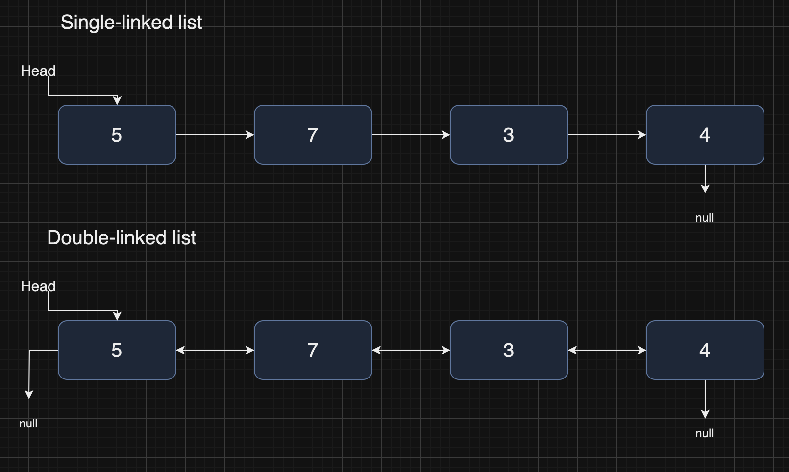

# Linked lists

Based on what we have seen in the [arrays](./arrays) part, we can say that this

```
const a = []
```

is _not_ an array, because it has `.push()` for example, so it can be extended! It is therefore not a array in the traditional sense.

So arrays:

- Don't have deletetion,
- Don't have insertion,
- They are ungrowable

We need something else, we need _linked lists_.

Linked lists are sequence of _nodes_ containing values. Here we see two different versions, single-linked and double-linked:



Source: GeeksForGeeks.

Each node contains some data and a _reference_ to the next value, if it exists. If we had to code this up in a TypeScript type we could write something like this:

```
type Node<T> = {
    val: T
    next?: Node<T>
}
```

The interesting thing about linked lists is that the operation of insertion and deletion are possible and they can happen at _constant_ time (this was true also for JavaScript arrays, where we could use indexes, but not for traditional, "real" arrays).

Linked lists don't have a concept of index, so if we want, say, to access the second value, one way is to take the first node, look at where it points at, and get the value of the second node. Above we see a _single linked list_, but they can be double, or two-ways.

How do we perform the operation of inserting a new value and deleting one in a linked lists? Let's consider the double-linked version.

### Insertion

Let us take the picture above: let's say we want to insert a 6 between 5 and 7. What we have to do is to create the following links

- 5 -> 6
- 6 -> 7
- 6 <- 7
- 5 <- 6

This takes `O(1)`, it does not depend on the input size.

### Deletion

Let's say we want to delete 3. We know that

4 = 3.next
7 = 3.prev

We need to do the following:

- 7.next = 4
- 4.prev = 2.prev.
- 3.prev = 3.next = null

Again this takes `O(1)`.
