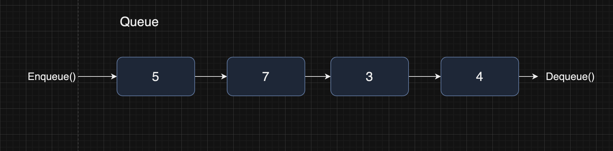

# Queues

A queue is a specific implementation of a linked list.



The following is a TypeScript implementation of a queue class:

```
type Node<T> = {
    value: T;
    next?: Node<T>;
};

export default class Queue<T> {
    public length: number;
    private head?: Node<T>;
    private tail?: Node<T>;

    constructor() {
        this.length = 0;
        this.head = this.tail = undefined;
    }

    enqueue(item: T): void {
        const node = { value: item } as Node<T>;
        this.length++;

        if (!this.tail) {
            this.head = this.tail = { value: item } as Node<T>;
        }

        this.tail.next = node;
        this.tail = node;
    }

    deque(): T | undefined {
        if (!this.head) {
            return undefined;
        }

        this.length--;
        const head = this.head;
        this.head = this.head.next;

        /** free */

        return head.value;
    }

    peek(): T | undefined {
        return this.head?.value;
    }
}
```
