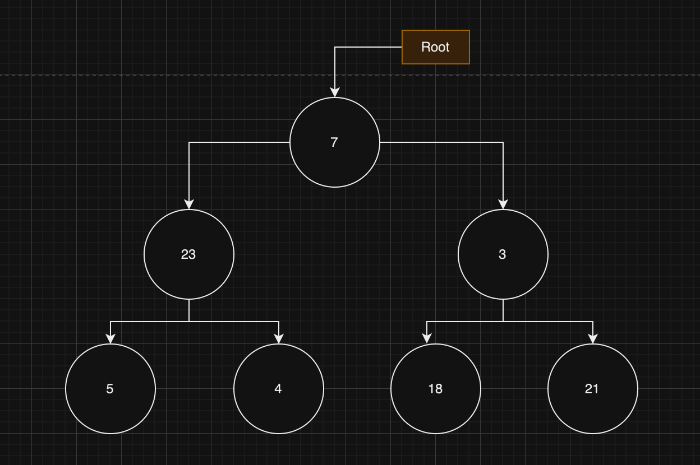

## Trees

First some terminology:

- Root: the first node
- Height: the longest path from the root to the "most child" node.
- Binary tree: a tree where each node has at most two children.
- General tree: a tree with 0 or more children.
- Binary search tree: a tree with a specific ordering to the nodes and where each node has at most two children.
- Leaves: nodes without children.
- Balanced: a tree is _perfectly balanced_ when any node's left and right children have the same height. The more a tree is unbalanced the more problematic algorithms with it becomes.
- Branching factor: the amount of children a tree has.



_Tree traversal_ is an attempt to visit every single node in a tree. We can do this in several ways:

- pre-order: we first visit the node and then recurse, so this will print (assuming we start from the root): `7`, 23, 5, 4, 3, 18, 21.
- in order: we first recurse left, then visit the node, then recurse right. This will yield: 5, 23, 4, `7`, 18, 3, 21
- post order: we first recurse left, then recurse right, then visit the node. This will print: 5, 4, 23, 18, 21, 3, `7`.

The interesting thing is that for pre-order root is at the beginning, in the middle for in order and at the end for post order.

Since we have to visit all the nodes the time complexity will be `O(N)`.

We now write algorithms to do these different types of travsersals:

### Pre-order traversal

```
function walk(curr: BinaryNode<number> | null, path: number[]): number[] {
    if (!curr) {
        return path;
    }

    path.push(curr.value);
    walk(curr.left, path);
    walk(curr.right, path);

    return path;
}

export default function pre_order_search(head: BinaryNode<number>): number[] {
    return walk(head, []);
}

```

### In-order traversal

```
function walk(curr: BinaryNode<number> | null, path: number[]): number[] {
    if (!curr) {
        return path;
    }

    walk(curr.left, path);
    path.push(curr.value);
    walk(curr.right, path);

    return path;

}

export default function in_order_search(head: BinaryNode<number>): number[] {
    return walk(head, []);
}
```

### Post-order traversal

```
function walk(curr: BinaryNode<number> | null, path: number[]): number[] {
    if (!curr) {
        return path;
    }

    walk(curr.left, path);
    walk(curr.right, path);
    path.push(curr.value);

    return path;
}

export default function post_order_search(head: BinaryNode<number>): number[] {
    return walk(head, []);
}

```

We can see that the only thing that changes is the order of the operations. Also note the clever use of the post-operation

```
walk(curr.right, path);
```

which allows us to backtrack.
