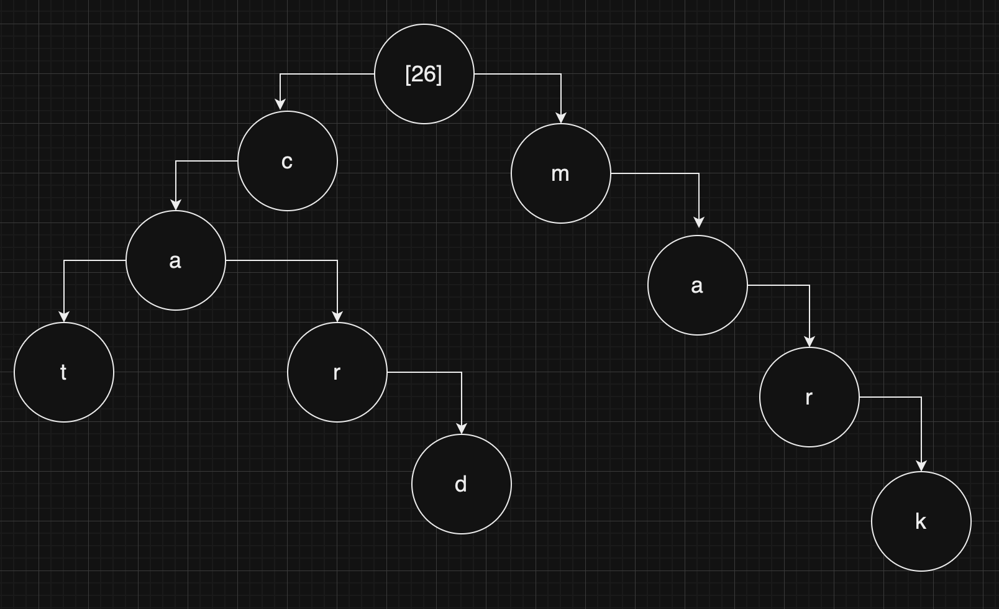

## Tries

Tries are a type of tree, similarly to heaps (i.e. priority queues). To understand tries, we will consider an example based on the English language.

This is a trie in which we can form words in the English language, in the head we see that the values of the children can only contain the 26 letters from the English alphabeth. Usually nodes can also say whether they are the end of a word. An interesting trivia is that autocomplete relies on a trie like this one, which can be explored with depth-first search to find words for example.

We can insert words in tries with a procedure consiting of checking if the current letter is already in the trie and if not add it. If it is already there we can just preserve it and check for the next letter.
Deletion, on the other hand, works very well with recursion, because we can first find the word and, as _post-operation_ delete it as we go back up.

These operations are _constant_ time, because _n_ in this case is not the string we are using as input but the amount of nodes, and as we add more and more nodes our "look-up" time does not change.
